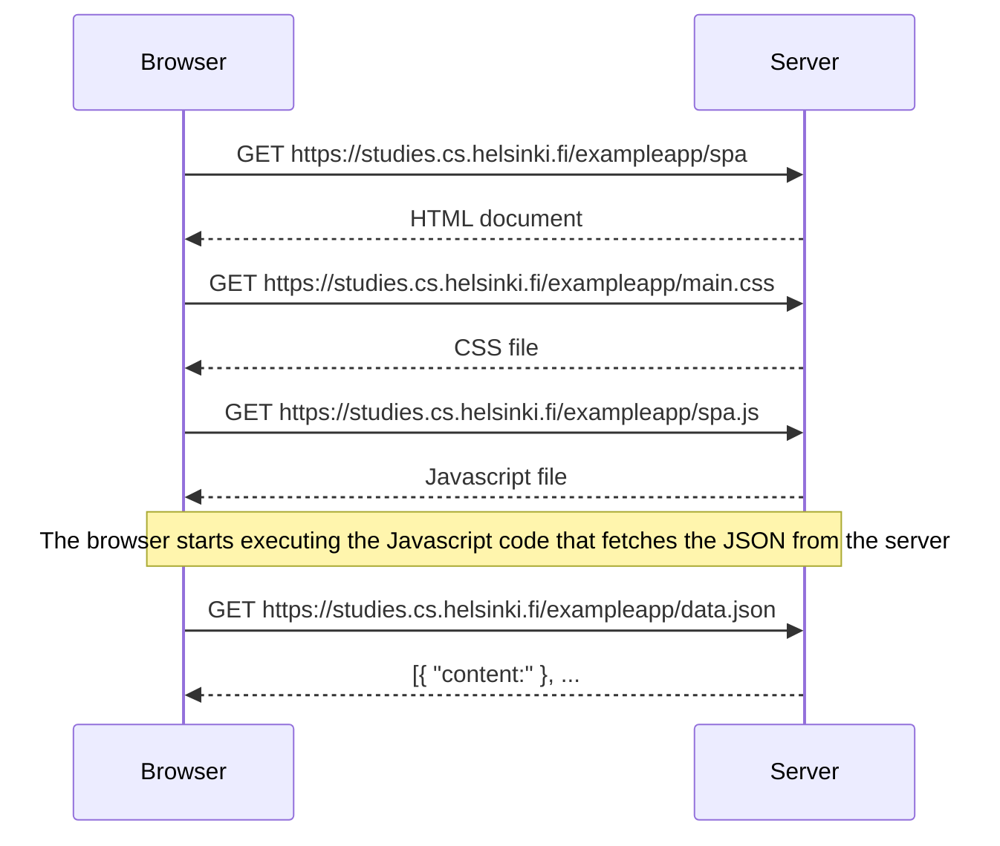

Sequence Diagram

```mermaid
sequenceDiagram
    participant Browser
    participant Server
    
    
     Browser->>Server: GET https://studies.cs.helsinki.fi/exampleapp/spa
     Server-->>Browser: HTML document
     
     Browser->>Server: GET https://studies.cs.helsinki.fi/exampleapp/main.css
     Server-->>Browser: CSS file
         
     Browser->>Server: GET https://studies.cs.helsinki.fi/exampleapp/spa.js
     Server-->>Browser: Javascript file
     
     Note over Browser, Server: The browser starts executing the Javascript code that fetches the JSON from the server
     Browser->>Server: GET https://studies.cs.helsinki.fi/exampleapp/data.json
     Server-->>Browser: [{ "content:" }, ... 
     
```
