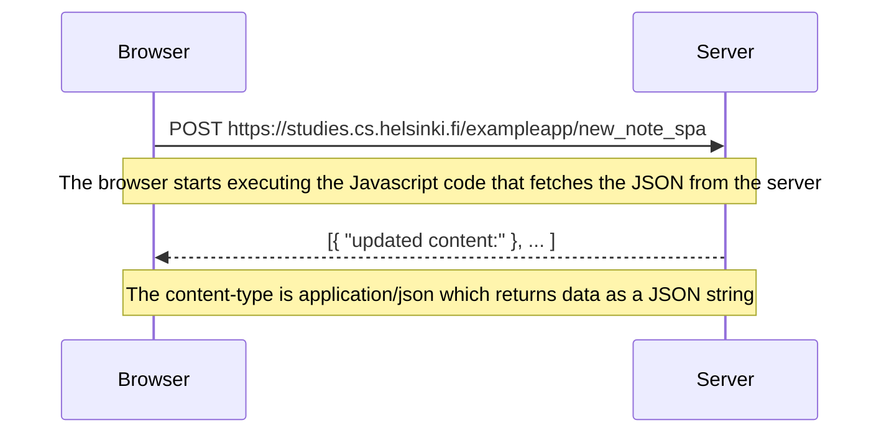

Sequence Diagram

```mermaid
sequenceDiagram
    participant Browser
    participant Server
    
    

     
     Browser->>Server: POST https://studies.cs.helsinki.fi/exampleapp/new_note_spa   
     Note over Browser, Server: The browser starts executing the Javascript code that fetches the JSON from the server
     
     Server-->>Browser: [{ "updated content:" }, ... ]
     Note over Browser, Server: The content-type is application/json which returns data as a JSON string
    
    
```
